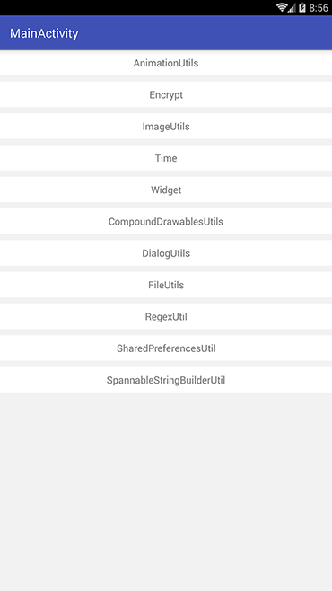

# CommonUtilsLibrary 

## [Download V1.0.1](https://github.com/ChinaDragon01/CommonUtilsLibrary-master.git)
 
开发过程中经常用到的类整理为工具类库

## 运行后的效果图

### 动态操作效果图：[动态效果图](https://github.com/ChinaDragon01/CommonUtilsLibrary-master/blob/master/gif/commonutilslibrary.gif)

 
### 部分页面效果图 

## 使用步骤
### 1. 工程根目录的build.gradle添加引用
	allprojects {
		repositories {
			...
			maven { url 'https://jitpack.io' }
		}
	}

### 2.1 module目录的build.gradle添加依赖（as 3.1.x版本之后的依赖方式）
	dependencies {
	        implementation 'com.github.ChinaDragon01:CommonUtilsLibrary-master:1.0.1'
	}

### 2.2 module目录的build.gradle添加依赖（as 3.1.x版本之前的依赖方式）
	dependencies {
	        compile 'com.github.ChinaDragon01:CommonUtilsLibrary-master:1.0.1'
	}

### 3. 添加权限
	<uses-permission android:name="android.permission.ACCESS_NETWORK_STATE"/>
    <uses-permission android:name="android.permission.ACCESS_WIFI_STATE"/>
    <uses-permission android:name="android.permission.WRITE_EXTERNAL_STORAGE"/>
    <uses-permission android:name="android.permission.READ_EXTERNAL_STORAGE"/>

# 声明
部分代码是参考别人写的，大多数代码是本人亲自敲写的！

## 在使用过程中有遇到bug，欢迎提issuse ! 如果你认为本库实用，请点Star, 谢谢！